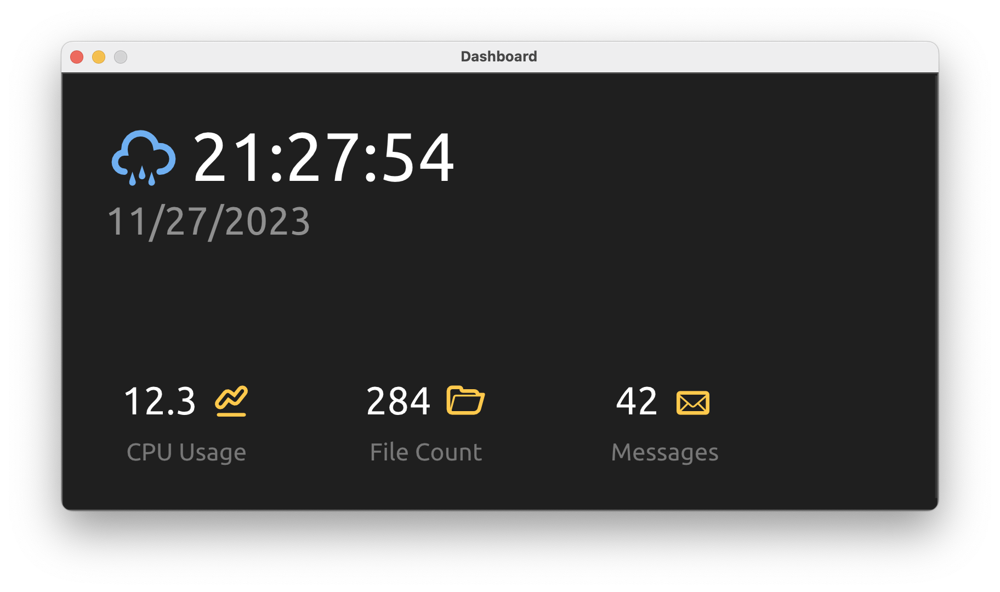

<p align="center">
    
</p>

# 

<p align="center">
    
</p>

``chibi-ui`` is a highly experimental UI *"framework"* to create native desktop applications using web technologies, while avoiding shipping a browser with the application or using any kind of webview. It uses [quickjs](https://github.com/quickjs-ng/quickjs) as the JavaScript engine and makes [ImGui](https://github.com/ocornut/imgui) available to the JavaScript code.

# Roadmap

## Phase 1: Low-Level ImGui Bindings

In the first phase of the project, the goal is to create low-level bindings to ImGui, so that it can be used from JavaScript. This will allow the creation of simple UI application that can be used to test the bindings and the JavaScript engine. The bindings are very "stiff" and do not provide any kind of abstraction over the ImGui API.

## Phase 2: High-Level JavaScript API

In the second phase of the project, the goal is to create a high-level JavaScript API build on top of the low-level bindings. This API will provide a more JavaScript-like interface to the ImGui API and syntax sugar to make it easier to use.

The goal will be to define custom components and more complex layouts with the least amount of code possible, while still being able to use the full power of ImGui.

## Phase 3: Optimizations

In the third phase of the project, the goal is to optimize the rendering of the UI. One possible approach might be to only re-render the UI when relevant state changes.

# Examples

The following example creates a simple window with a button that prints a message to console when pressed. The ``globalThis.tick`` function is called every frame.

```javascript
globalThis.tick = () => {
    imgui.begin("Hello World", 0);
    {
        if (imgui.button('Test Button')) { print("button pressed!") }
    }
    imgui.end();
    
    imgui.showMetricsWindow();
}
```

See ``examples/`` for more examples

# CLI

```
chibi-ui <entrypoint.js>
```

# Building

...

# Icon Credits

<a href="https://www.flaticon.com/free-icons/cute-food" title="cute food icons">Cute food icons created by Freepik - Flaticon</a>